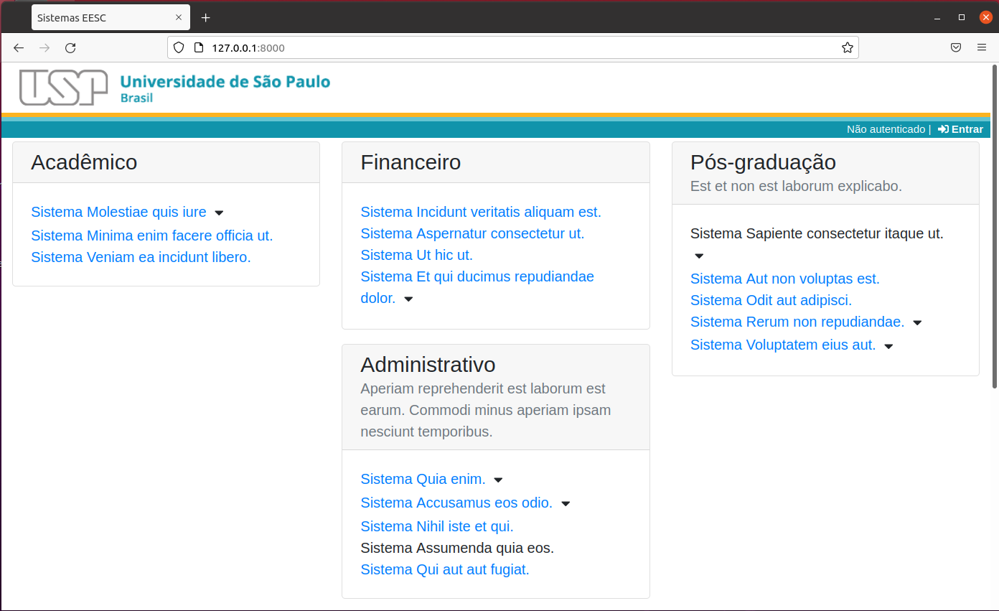

# Portal-sistemas

O Portal-sistemas permite criar um site para listar itens organizados em grupos.

## Características

* Grupos são dispostos em até 4 colunas
* Grupos e ítens podem conter texto adicional. No grupo é sempre visível, no item pode ser exibido clicando no botão 
* Login usando senha única: somente usuários autorizados previamente
* Admins gerenciam usuários
* Gerentes editam o conteúdo (grupos e ítens)

Esse sistema pode ser usado como portal de sistemas da Unidade mas também pode ser usado como uma coleção de links para uma finalidade específica.

## Instalação e configuração

Procedimentos básicos para aplicações Laravel:

* Clonar o projeto
* Instalar as dependências com `composer install`
* copiar o `.env.example` para `.env`
* gerar chave: `php artisan key:generate`
* configurar o `.env`: app, database, senhaunica, theme, replicado
* rodar migrations: `php artisan migrate --seed` (ambiente dev)
* rodar: `php artisan serve`

Em ambiente **dev**, pode ser útil utilizar o [senhaunica-faker](https://github.com/uspdev/senhaunica-faker/).

## Para desenvolvedores

Este projeto utiliza as bibliotecas [laravel-usp-theme](https://github.com/uspdev/laravel-usp-theme/), [senhaunica-socialite](https://github.com/uspdev/senhaunica-socialite/) e [replicado](https://github.com/uspdev/replicado/). Este conjunto permite criar rapidamente a base para uma aplicação laravel.

O portal-sistemas é um sistema simples construído em torno de uma única página. Com isso, no arquivo web.php, é configurado somente uma rota para a página principal. 

Possui duas tabelas, uma de grupos e outras de ítens, relacionadas entre si. 

Para gerenciamento, é utilizado o [livewire](https://laravel-livewire.com/), cujas rotas são configuradas pela própria biblioteca.

Para os forms, foram criados [componentes](https://laravel.com/docs/8.x/blade#components) para livewire que agilizam e mantém mais limpos os arquivos blade.
